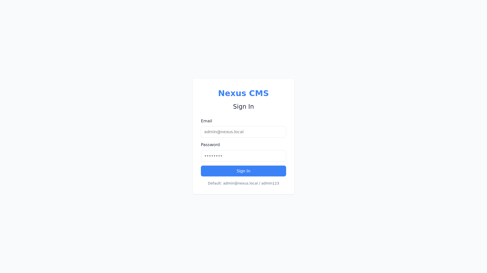

# 🚀 Nexus CMS

> Un CMS Headless modulaire construit avec Rust (Axum) + React


Nexus est un CMS Headless puissant et modulaire qui sépare le backend de gestion de contenu de la couche de présentation frontend. Construit avec Rust pour des performances élevées et React pour une expérience utilisateur moderne.


## ✨ Fonctionnalités

### Backend (Rust/Axum)
- 🔐 **Authentification JWT** - Auth sécurisée par token avec refresh tokens
- 📝 **Gestion des Pages** - Créer, éditer, publier des pages avec métadonnées SEO
- 🧱 **Système de Blocs** - Blocs de contenu modulaires (Hero, RichText, ProjectGrid, etc.)
- 📁 **Collections** - Types de contenu personnalisés avec schémas dynamiques
- 🖼️ **Gestion des Médias** - Upload de fichiers avec glisser-déposer
- 👥 **Accès Basé sur les Rôles** - Permissions granulaires (Super-Architecte, Gestionnaire, VIP, Visiteur)
- ⚡ **Limitation de Débit** - Protection DDoS intégrée
- 🛡️ **Headers de Sécurité** - CORS, CSP, HSTS, X-Frame-Options
- 🔧 **Mode Maintenance** - Maintenance système avec contournement admin

### Frontend (React/Vite)
- 🎨 **Interface Moderne** - Design épuré et responsive
- 🔄 **Aperçu en Temps Réel** - Aperçu des blocs en direct pendant l'édition
- 🧭 **Navigation Intuitive** - Sidebar, onglets et fil d'Ariane
- 📱 **Responsive** - Fonctionne sur desktop et mobile
- 🔐 **Routes Protégées** - Zones admin sécurisées par auth

## 🏗️ Architecture

```
┌─────────────────────────────────────────────────────────────┐
│                        Frontend (React)                      │
│  ┌─────────┐  ┌─────────┐  ┌─────────┐  ┌─────────────┐  │
│  │  Pages  │  │  Admin  │  │  Auth   │  │  Block Ed.  │  │
│  └────┬────┘  └────┬────┘  └────┬────┘  └──────┬──────┘  │
└───────┼────────────┼────────────┼──────────────┼──────────┘
        │            │            │              │
        └────────────┴────────────┴──────────────┘
                           │
                    REST API (/api/v1)
                           │
┌───────────────────────────┼───────────────────────────────┐
│                     Backend (Rust)                         │
│  ┌─────────┐  ┌─────────┐  ┌─────────┐  ┌───────────┐ │
│  │ Auth    │  │ Pages   │  │ Blocks  │  │  Media    │ │
│  └────┬────┘  └────┬────┘  └────┬────┘  └─────┬─────┘ │
│       └────────────┴────────────┴──────────────┘       │
│                           │                              │
│                    PostgreSQL                             │
└───────────────────────────────────────────────────────────┘
```

## 🚀 Démarrage Rapide

### Prérequis
- Docker & Docker Compose
- Node.js 18+ (pour le développement frontend)
- Rust 1.75+ (pour le développement backend)

### Utiliser Docker Compose

```bash
# Cloner le dépôt
git clone https://github.com/TestD-Aho/nexus.git
cd nexus

# Démarrer tous les services
docker-compose up -d

# Accéder à l'application
Frontend:  http://localhost:5173
Backend:   http://localhost:3000
```

### Installation Manuelle

#### Backend
```bash
cd backend

# Créer le fichier environment
cp .env.example .env
# Éditer .env avec votre URL de base de données et secret JWT

# Lancer les migrations et démarrer le serveur
cargo run
```

#### Frontend
```bash
cd frontend

# Installer les dépendances
npm install

# Démarrer le serveur de développement
npm run dev
```

## 📡 Points de Terminaison API

| Méthode | Endpoint | Description | Auth |
|---------|----------|-------------|------|
| `POST` | `/api/v1/auth/login` | Connexion utilisateur | ❌ |
| `POST` | `/api/v1/auth/register` | Inscription utilisateur | ❌ |
| `GET` | `/api/v1/auth/me` | Obtenir l'utilisateur actuel | ✅ |
| `GET` | `/api/v1/pages` | Lister toutes les pages | ❌ |
| `POST` | `/api/v1/pages` | Créer une page | ✅ |
| `GET` | `/api/v1/pages/:slug` | Obtenir une page par slug | ❌ |
| `PUT` | `/api/v1/pages/:id` | Mettre à jour une page | ✅ |
| `DELETE` | `/api/v1/pages/:id` | Supprimer une page | ✅ |
| `GET` | `/api/v1/blocks` | Lister les blocs | ❌ |
| `POST` | `/api/v1/blocks` | Créer un bloc | ✅ |
| `POST` | `/api/v1/blocks/reorder` | Réordonner les blocs | ✅ |
| `GET` | `/api/v1/media` | Lister les médias | ❌ |
| `POST` | `/api/v1/media/upload` | Uploader un fichier | ✅ |
| `GET` | `/api/v1/admin/stats` | Statistiques admin | 🔒 |
| `GET` | `/api/v1/admin/users` | Lister les utilisateurs | 🔒 |
| `PUT` | `/api/v1/system/maintenance` | Basculer maintenance | 🔒 |

## 🧱 Types de Blocs

| Type de Bloc | Description |
|--------------|-------------|
| `HeroHeader` | Section hero pleine largeur avec titre, sous-titre, fond |
| `RichText` | Contenu texte riche HTML |
| `ProjectGrid` | Grille d'affichage des projets/portfolio |
| `SkillMatrix` | Affichage des compétences/tags |
| `ContactForm` | Formulaire de contact avec validation |
| `TestimonialSlider` | Témoignages/clients satisfaits |

## 👥 Rôles et Permissions

| Rôle | Description | Permissions |
|------|-------------|-------------|
| `Super-Architecte` | Admin root | Accès système complet |
| `Gestionnaire` | Gestionnaire de contenu | Pages, blocs, médias, collections |
| `VIP` | Utilisateur premium | Lecture contenu public |
| `Visiteur` | Visiteur anonyme | Lecture contenu public |

## 🖥️ Captures d'Écran

### Page de Connexion


### Tableau de Bord Admin


### Éditeur de Page avec Constructeur de Blocs


### Bibliothèque de Médias


### Page Publique


## 🛠️ Stack Technique

### Backend
- **Runtime**: Rust
- **Framework**: Axum
- **Base de données**: PostgreSQL
- **ORM**: SQLx
- **Auth**: JWT (hachage Argon2)
- **Validation**: serde

### Frontend
- **Framework**: React 18
- **Outil de build**: Vite
- **Routing**: React Router 6
- **Client HTTP**: Axios
- **Styling**: CSS personnalisé

### Infrastructure
- **Conteneur**: Docker
- **Orchestration**: Docker Compose

## 📁 Structure du Projet

```
nexus/
├── backend/
│   ├── src/
│   │   ├── api/          # Routes API
│   │   ├── db/           # Base de données et migrations
│   │   ├── middleware/   # Sécurité et limitation de débit
│   │   ├── models/       # Modèles de données
│   │   ├── services/    # Logique métier
│   │   └── utils/        # Helpers
│   ├── Cargo.toml
│   └── Dockerfile
├── frontend/
│   ├── src/
│   │   ├── api/          # Client API
│   │   ├── components/   # Composants réutilisables
│   │   ├── context/      # React context
│   │   ├── pages/        # Composants de pages
│   │   └── App.jsx       # Application principale
│   ├── package.json
│   └── Dockerfile
├── capture/              # Captures d'écran
├── docker-compose.yml
└── README.md
```

## 🔧 Configuration

### Variables d'Environnement (Backend)

| Variable | Description | Défaut |
|----------|-------------|---------|
| `DATABASE_URL` | Chaîne de connexion PostgreSQL | Requis |
| `JWT_SECRET` | Clé secrète pour la signature JWT | Requis |
| `NEXUS_HOST` | Hôte du serveur | `0.0.0.0` |
| `NEXUS_PORT` | Port du serveur | `3000` |
| `NEXUS_UPLOAD_DIR` | Répertoire d'upload | `./uploads` |
| `NEXUS_MAX_UPLOAD_SIZE` | Taille max upload (octets) | `10485760` |

## 📄 Licence

Licence MIT - voir [LICENSE](LICENSE) pour les détails.

## 🤝 Contribuer

1. Forker le dépôt
2. Créer votre branche de fonctionnalité (`git checkout -b feature/feature-incroyable`)
3. Commiter vos changements (`git commit -m 'Ajouter une feature incroyable'`)
4. Pousser vers la branche (`git push origin feature/feature-incroyable`)
5. Ouvrir une Pull Request

---

<p align="center">Construit avec ❤️ avec Rust + React</p>
